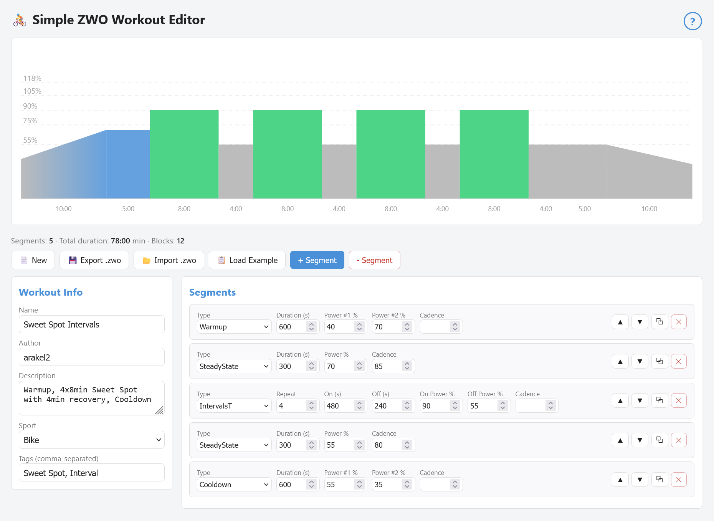

# ZWO Workout Editor

A simple, browser-based editor for creating and editing [Zwift](https://www.zwift.com/) workout files (`.zwo`).

## Features

- **Create workouts** with all ZWO segment types: Warmup, Cooldown, SteadyState, Ramp, IntervalsT, FreeRide, MaxEffort
- **Visual power chart** with color-coded training zones and gradient ramps 
- **Import** existing `.zwo` files for editing
- **Export** workouts as `.zwo` for use in Zwift
- **Interactive selection** — click chart blocks or segment rows to highlight and navigate
- **Zero dependencies** — single HTML file, no build tools, no server required
- **Privacy** — everything runs locally in your browser, no data is sent anywhere

## Getting Started

1. Download or clone this repository
2. Open `index.html` in your browser
3. Start building your workout

Or try it live on [GitHub Pages](https://arakel2.github.io/zwo-workout-editor/).

## Usage

| Action         | How                                                          |
| -------------- | ------------------------------------------------------------ |
| Add segment    | Click **+ Segment** (inserted after selected segment, or at the end) |
| Select segment | Click a chart block or a segment row                         |
| Edit values    | Change fields directly — power values are in **% of FTP**    |
| Reorder        | Use **▲▼** buttons on each segment                           |
| Duplicate      | Click **⧉** on a segment                                     |
| Delete         | Click **✕** on a segment, or select + **- Segment**          |
| Export         | Click **Export .zwo** to download                            |
| Import         | Click **Import .zwo** to load an existing file               |

## ZWO File Format

The `.zwo` format is Zwift's XML-based workout file format. Power values are stored as decimals relative to FTP (e.g., `0.75` = 75% FTP). Durations are in seconds.

For format details, see the [Zwift Workout File Reference](https://github.com/h4l/zwift-workout-file-reference).

## Training Zones

The chart uses Coggan's classic power training zones:

| Zone | Name            | % FTP    | Color  |
| ---- | --------------- | -------- | ------ |
| Z1   | Active Recovery | < 55%    | Gray   |
| Z2   | Endurance       | 55–75%   | Blue   |
| Z3   | Tempo           | 75–90%   | Green  |
| Z4   | Threshold       | 90–105%  | Yellow |
| Z5   | VO2max          | 105–118% | Orange |
| Z6   | Anaerobic       | 118–150% | Red    |
| Z7   | Neuromuscular   | > 150%   | Purple |

## Tech Stack

- Vanilla JavaScript (ES6+)
- Inline CSS
- SVG for chart rendering
- Built-in `DOMParser` for ZWO import
- No frameworks, no build step, no external dependencies

## License

[MIT](LICENSE) — do whatever you want with it.

## Acknowledgements

- ZWO format reference by [h4l](https://github.com/h4l/zwift-workout-file-reference)
- Training zones based on Andrew Coggan's power zones
- Built with the help of [Duck.ai](https://duck.ai/)